# Agentic AI-Powered Database Migration Platform — Architecture

> **Migration matrix**: any of Oracle, MySQL, PostgreSQL can act as source or target. A single `DialectPair` in `MigrationState` (see [§7](#7-shared-state-schema)) determines direction at job-creation time; agents and adapters are direction-agnostic — they read `dialects.source` / `dialects.target` and dispatch to the matching plugin pair.

> Status: Design baseline (v1.0) — merges `Capstone_Proposal.md` (agentic/API/UI framework) with `human_plan.md` (concrete migration tooling).
> Supported migrations: **any-to-any interconversion between Oracle, MySQL, and PostgreSQL** (e.g. Oracle→PostgreSQL, MySQL→Oracle, PostgreSQL→MySQL, etc). Each dialect is a symmetric plugin usable as either source or target — SQL Server is not in scope.

## Table of Contents

1. [Guiding Principles](#1-guiding-principles)
2. [System Context](#2-system-context)
3. [High-Level Architecture](#3-high-level-architecture)
4. [Repository Structure](#4-repository-structure)
5. [Agent Catalog & Tool Mapping](#5-agent-catalog--tool-mapping)
6. [Orchestration: LangGraph State Machine](#6-orchestration-langgraph-state-machine)
7. [Shared State Schema](#7-shared-state-schema)
8. [Phase-by-Phase Sequence Diagrams](#8-phase-by-phase-sequence-diagrams)
9. [Human-in-the-Loop Approval Flow](#9-human-in-the-loop-approval-flow)
10. [Data & Knowledge Stores](#10-data--knowledge-stores)
11. [Deployment Architecture](#11-deployment-architecture)
12. [CI/CD Pipeline](#12-cicd-pipeline)
13. [Observability](#13-observability)
14. [Security Considerations](#14-security-considerations)
15. [Extensibility: Adding New Features](#15-extensibility-adding-new-features)
16. [Open Questions / Future Work](#16-open-questions--future-work)

---

## 1. Guiding Principles

- **Plugin-first**: every source dialect, target dialect, and migration tool is a swappable adapter behind a stable interface — never hard-coded into agent logic.
- **Stateful orchestration, not scripts**: LangGraph owns the end-to-end workflow state so any phase can pause, resume, replay, or be re-entered after human review.
- **Human-in-the-loop is a first-class node**, not an afterthought — high-risk transitions always route through an interrupt.
- **Deterministic validation over LLM trust**: schema/code translation may use LLM reasoning, but data correctness is always confirmed by deterministic checksum/reconciliation code.
- **Everything observable**: every agent call, tool invocation, and state transition is traced (LangSmith/LangFuse) and every infra/runtime metric is scraped (Prometheus/Grafana).
- **Infra as code, deploy as code**: Terraform provisions cloud resources; Kubernetes manifests/Helm charts describe runtime; nothing is clicked manually.

---

## 2. System Context

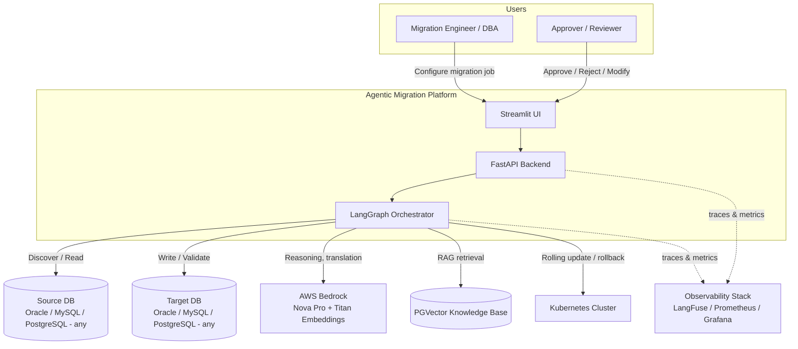

---

## 3. High-Level Architecture

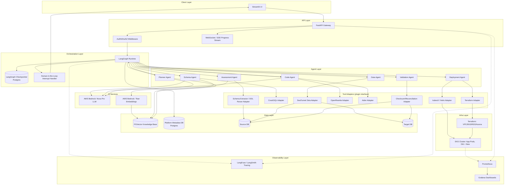

---

## 4. Repository Structure

Monorepo, modular per agent, with plugin adapters isolated so new dialects/tools slot in without touching orchestration code.

```
migration-platform/
├── apps/
│   ├── ui-streamlit/              # Human review + job configuration UI
│   └── api-fastapi/               # REST/WebSocket gateway, auth, job queue
├── orchestrator/
│   ├── graph.py                   # LangGraph StateGraph definition (nodes/edges)
│   ├── state.py                   # Shared Pydantic state schema
│   └── checkpointer.py            # Postgres-backed checkpoint store
├── agents/
│   ├── assessment_agent/
│   ├── schema_agent/
│   ├── data_agent/
│   ├── code_agent/
│   ├── validation_agent/
│   ├── deployment_agent/
│   └── planner_agent/
├── tool_adapters/                 # Plugin interface: BaseToolAdapter
│   ├── base.py                    # Abstract adapter contract (run/status/rollback)
│   ├── schema_extractor_adapter/  # generates schema.sql per dialect, parses via SQL/DDL parser
│   ├── cracksql_adapter/
│   ├── seatunnel_adapter/
│   ├── openrewrite_adapter/
│   ├── aider_adapter/
│   ├── checksum_adapter/
│   ├── kubectl_adapter/
│   └── terraform_adapter/
├── dialects/                      # Source/target dialect plugins
│   ├── base.py                    # Abstract Dialect contract (type map, SQL grammar hooks)
│   ├── oracle/                # symmetric: usable as source or target
│   ├── mysql/                 # symmetric: usable as source or target
│   └── postgresql/            # symmetric: usable as source or target
├── knowledge_base/
│   ├── ingestion/                 # Loads mapping rules, best practices into PGVector
│   └── retrievers/
├── infra/
│   ├── terraform/                 # VPC, EKS, RDS/Aurora, IAM modules
│   ├── k8s/                       # Helm charts / manifests per app
│   └── github-actions/            # CI/CD workflows
├── observability/
│   ├── langfuse/                  # Tracing config
│   └── grafana-dashboards/
├── tests/
│   ├── unit/
│   ├── integration/
│   └── e2e/
└── docs/
    ├── architecture.md            # this file
    └── adr/                       # Architecture Decision Records
```

**Extension contract:** a new source dialect = new folder under `dialects/` implementing `base.py`; a new migration tool = new folder under `tool_adapters/` implementing `BaseToolAdapter`; neither requires editing `orchestrator/graph.py`.

---

## 5. Agent Catalog & Tool Mapping

| # | Agent | Responsibility (Capstone) | Tool (human_plan) | Adapter |
|---|-------|---------------------------|--------------------|---------|
| 1 | **Planner Agent** | Builds migration plan: sequence, priorities, risk levels, effort, manual-review flags | LLM reasoning + RAG over knowledge base | — (no external tool, pure LangGraph node) |
| 2 | **Assessment Agent** | Discovery & schema analysis, dependency graph | Code-generated `schema.sql` (native per-dialect DDL export) + SQL/DDL parser (e.g. sqlglot) | `schema_extractor_adapter` |
| 3 | **Schema Agent** | DDL / stored procedure / trigger / view translation, source→target dialect | CrackSQL (hybrid AST + LLM) | `cracksql_adapter` |
| 4 | **Data Agent** | Bulk historical load + streaming CDC | Apache SeaTunnel (Zeta engine) | `seatunnel_adapter` |
| 5 | **Code Agent** | Application refactor: ORM/JDBC swap (Java/Spring), raw SQL/SQLAlchemy rewrite (C++/Python) | OpenRewrite (AST) + Aider (LLM CLI) | `openrewrite_adapter`, `aider_adapter` |
| 6 | **Validation Agent** | Row counts, checksums, referential integrity, aggregate comparisons | Custom Python (Pandas/PySpark hashing) | `checksum_adapter` |
| 7 | **Deployment Agent** | Cutover rollout + automatic rollback on failure | kubectl (rolling update, `rollout undo`), Terraform (infra provisioning) | `kubectl_adapter`, `terraform_adapter` |

Each adapter implements the same contract so agents call adapters generically:

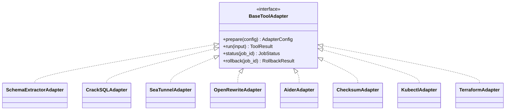

---

## 6. Orchestration: LangGraph State Machine

LangGraph drives the full workflow: **Discover → Analyse → Plan → Transform → Generate → Validate → Test → Approve → Migrate → Verify**. Every human-approval point is a graph **interrupt**; on resume, the graph re-enters exactly where it paused (via the Postgres checkpointer).

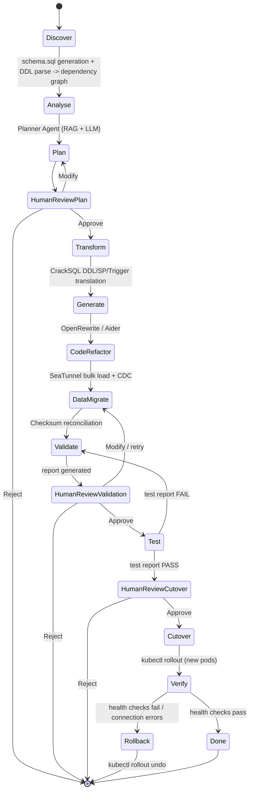

Graph nodes map 1:1 to LangGraph `StateGraph` nodes; conditional edges are implemented as router functions reading `state.status` / `state.validation_result`.

---

## 7. Shared State Schema

Single Pydantic model threaded through the entire graph and persisted at every checkpoint — this is what makes replay, audit, and mid-flight resumption possible.

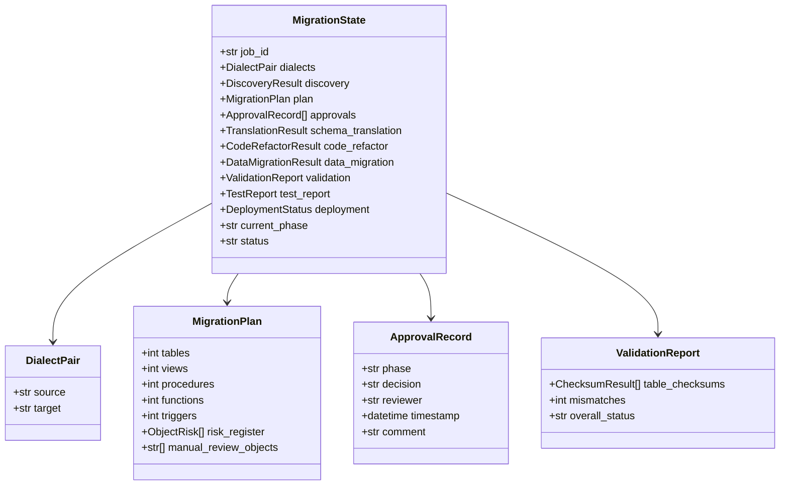

---

## 8. Phase-by-Phase Sequence Diagrams

### 8.1 Discovery & Assessment

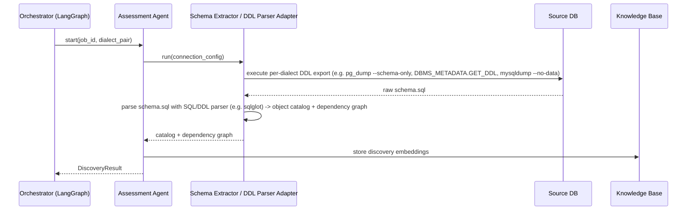

### 8.2 Schema & Logic Translation

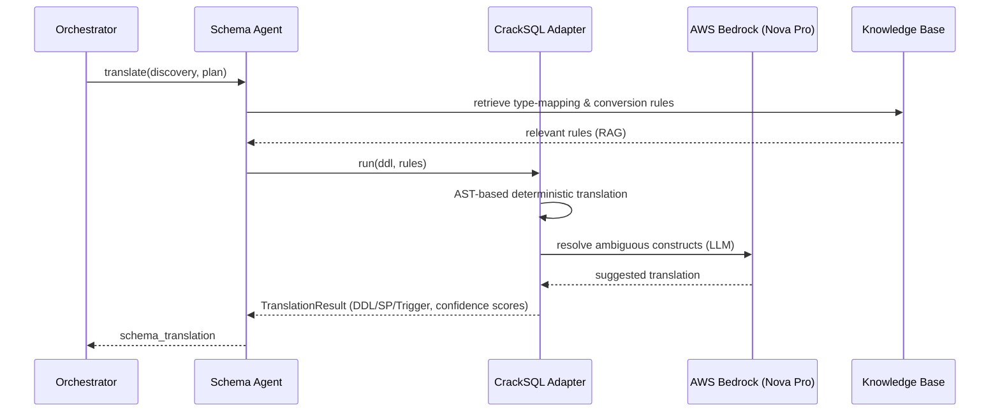

### 8.3 Data Migration

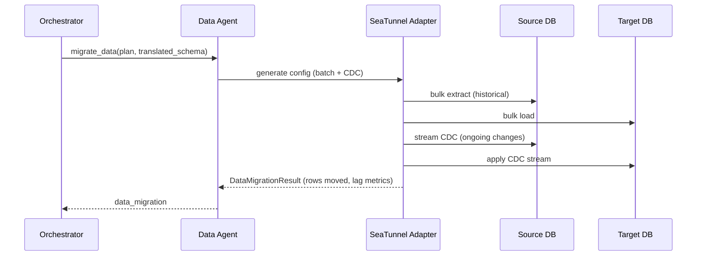

### 8.4 Application Code Refactoring

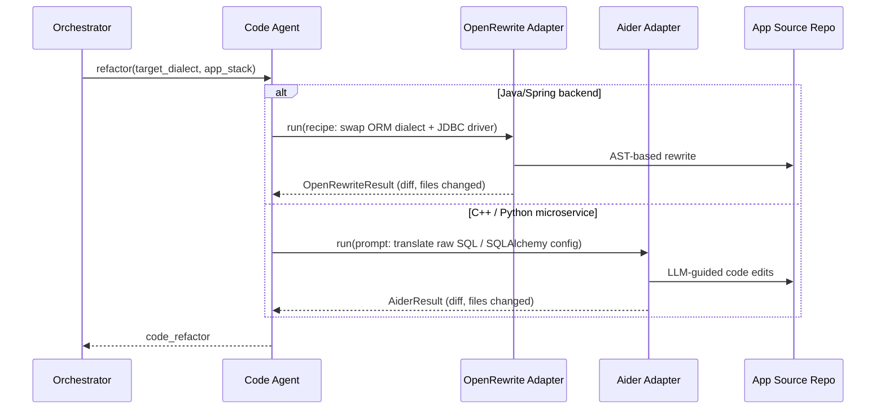

### 8.5 Validation & Reconciliation

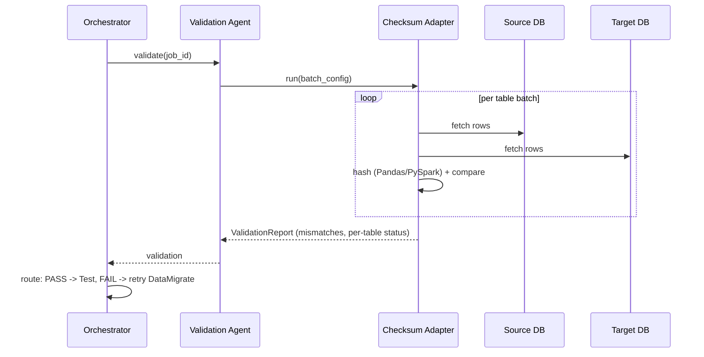

### 8.6 Cutover & Rollback

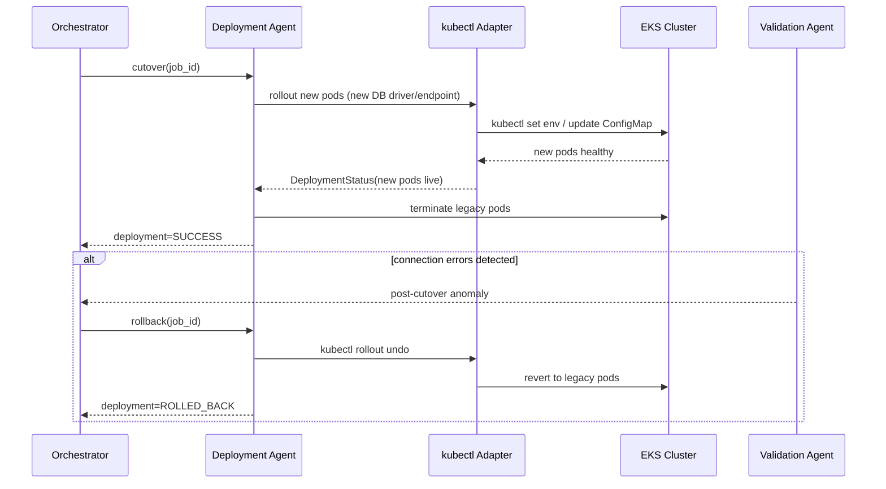

---

## 9. Human-in-the-Loop Approval Flow

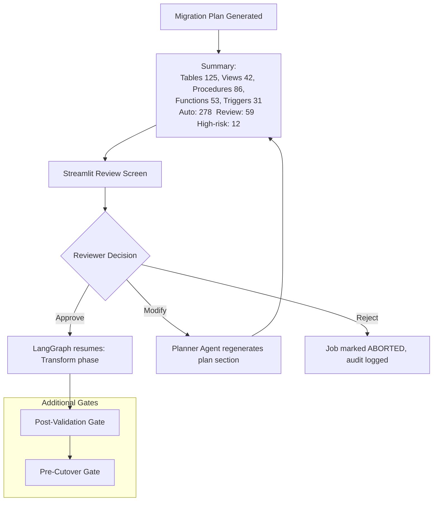

Each gate persists an `ApprovalRecord` (reviewer, decision, timestamp, comment) into the metadata DB for full audit trail.

---

## 10. Data & Knowledge Stores

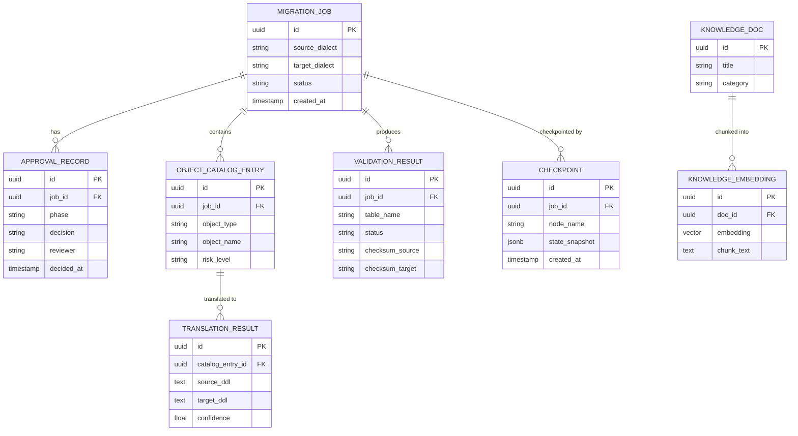

- **Platform Metadata DB** (Postgres): jobs, approvals, catalog, checkpoints — operational state.
- **PGVector Knowledge Base**: type-mapping rules, vendor syntax quirks, known incompatibilities, historical issues — embedded with Titan Embeddings, retrieved via RAG by Planner/Schema Agents.

---

## 11. Deployment Architecture

Terraform provisions cloud infrastructure; Kubernetes (EKS) runs the platform and the migrated application; both are treated as production-grade from day one per requirements.

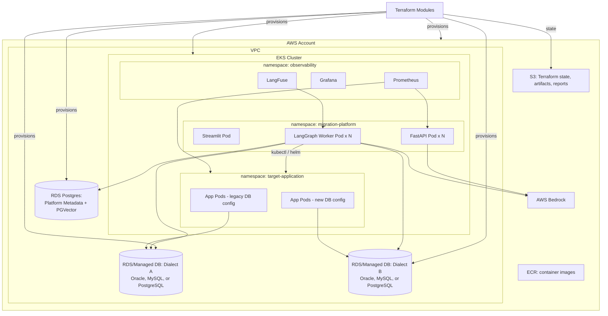

Dialect assignment to `RDS_A`/`RDS_B` is per-job, driven by the `DialectPair` in `MigrationState` — the same Terraform module (`rds-instance`) is parameterized by engine type rather than having fixed "source" and "target" modules.

- Terraform modules: `network`, `eks`, `rds-instance` (parameterized: oracle/mysql/postgres), `metadata-db`, `iam`.
- Helm charts per app under `infra/k8s/`; the Deployment Agent calls `kubectl`/`helm` scoped to `ns-app` only (least privilege — cannot touch `ns-platform`).

---

## 12. CI/CD Pipeline

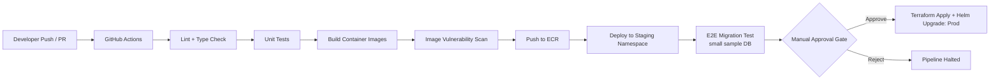

---

## 13. Observability

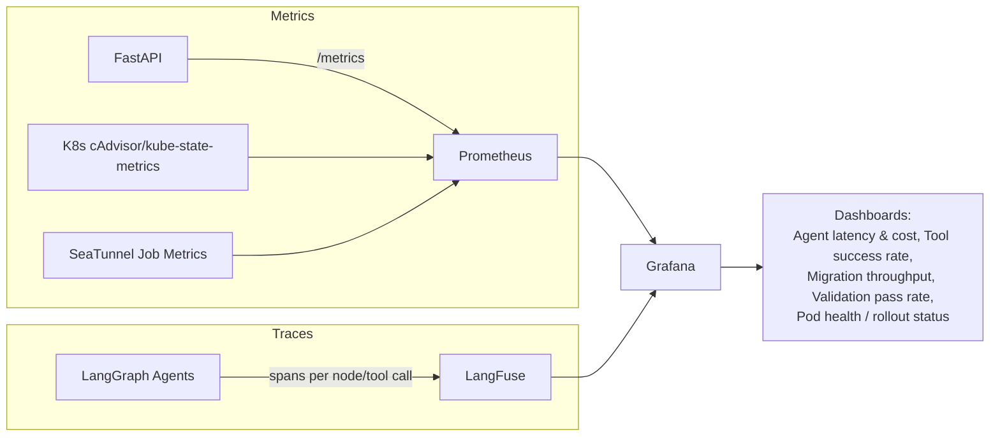

Every LLM call (Bedrock Nova Pro / Titan) is wrapped with a LangFuse span capturing prompt, tokens, latency, and cost — enabling per-job cost attribution and prompt regression detection.

---

## 14. Security Considerations

- **Least privilege**: Deployment Agent's Kubernetes service account is scoped via RBAC to only the `target-application` namespace; it cannot modify `migration-platform` or `observability` namespaces.
- **Secrets management**: DB credentials and Bedrock IAM roles are never stored in state or logs — sourced from AWS Secrets Manager / IRSA (IAM Roles for Service Accounts), injected at runtime.
- **Input validation boundary**: FastAPI validates all job configuration (connection strings, dialect names) against an allow-list before any adapter executes — prevents injection into generated SQL/kubectl commands.
- **SQL/command injection**: CrackSQL and checksum adapters use parameterized queries; `kubectl`/`terraform` adapters build commands from typed config objects, never raw string interpolation.
- **Audit trail**: every approval, rejection, and rollback is immutably logged (`APPROVAL_RECORD`, checkpoint history) for compliance review.
- **Network isolation**: source and target DBs live in private subnets; only the orchestrator pods have security-group access.
- **LLM output as untrusted input**: LLM-suggested DDL/code diffs are never auto-applied — they pass through the human approval gate (or, at minimum, automated test/validation) before merge/execution.

---

## 15. Extensibility: Adding New Features

| To add... | Do this | Touch orchestrator? |
|---|---|---|
| New dialect (e.g. DB2, SQL Server) | Implement `dialects/<name>/` against `dialects/base.py` (type map, grammar hooks); immediately usable as both source and target since the contract is symmetric | No |
| New migration tool (replace SeaTunnel) | Implement `tool_adapters/<tool>_adapter/` against `BaseToolAdapter` | No |
| New agent (e.g. Performance-Tuning Agent) | Add module under `agents/`, register as a LangGraph node + edge in `orchestrator/graph.py` | Yes (one node + edges) |
| New approval gate | Add `HumanReview*` node + interrupt in the state graph | Yes (one node) |
| New observability signal | Add exporter in `observability/` and a Grafana dashboard JSON | No |

The rule of thumb: **agents change when workflow phases change; adapters change when tools change; dialects change when database vendors change** — these three concerns never overlap in the same file.

---

## 16. Open Questions / Future Work

- Multi-tenant isolation model if the platform serves multiple migration projects concurrently.
- Cost controls/guardrails for Bedrock usage during large-schema translation (batching, caching CrackSQL LLM fallbacks).
- Formal risk-scoring rubric for the Planner Agent's "High Risk Objects" classification (currently rule-based + LLM judgment — needs calibration against historical migrations).
- Disaster-recovery plan for the platform's own metadata DB (checkpoints) independent of the migration's source/target DBs.
